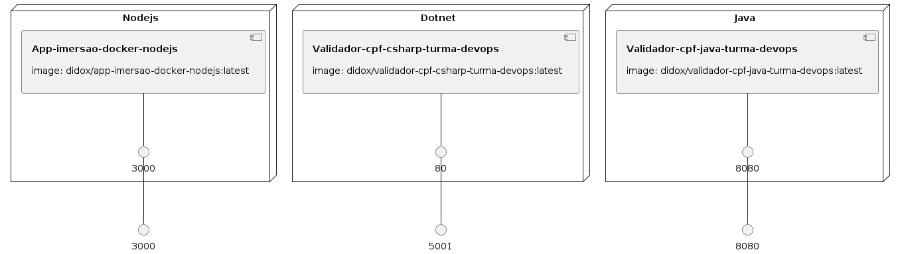

# Docker
- Docker é um conjunto de produtos de plataforma como serviço (PaaS) que usam virtualização de nível de sistema operacional para entregar software em pacotes chamados contêineres. Os contêineres são isolados uns dos outros e agrupam seus próprios softwares, bibliotecas e arquivos de configuração. Eles podem se comunicar uns com os outros por meio de canais bem definidos. Todos os contêineres são executados por um único kernel do sistema operacional e, portanto, usam menos recursos do que as máquinas virtuais.
- https://www.docker.com/


### Dockerfile Java
```Dockerfile
FROM openjdk:8-jdk-alpine
ARG JAR_FILE=target/*.jar
COPY ${JAR_FILE} app.jar

ENTRYPOINT ["java","-jar","/app.jar"]
```

#### Build Docker
```shell
docker build -t didox/SEU_APP -f Dockerfile .
```

### Build Docker and run
```shell
docker run -d -p 80:3000 --name SEU_CONTAINER didox/SEU_APP
```

### Build watch Docker
```shell
docker run -it -p 80:3000 --name SEU_CONTAINER didox/SEU_APP
```

# Para subir app no docker
```shell
docker start SEU_CONTAINER
```

# Para parar o docker
```shell
docker stop SEU_CONTAINER
```

### Lista processos ativos
```shell
docker ps
```

### Lista todos os containers
```shell
docker ps -a
```

### Para remover a imagem do docker
```shell
docker rm SEU_CONTAINER
docker rm SEU_CONTAINER --force
```

### Para depurar
```shell
docker attach SEU_CONTAINER
```

### Entra dentro do container
```shell
docker exec -it SEU_CONTAINER bash
docker exec -it SEU_CONTAINER /bin/sh
docker exec -it SEU_CONTAINER /bin/bash
```

### Roda comando dentro do container
```shell
docker exec -it SEU_CONTAINER ls -la
```

### Para ver logs
```shell
docker logs SEU_CONTAINER -f --tail 100
```

### Iniciando container passando variáveis de ambiente
```shell
export USER='root' 
export PASSWORD='root' 
export DATABASE_URL='mysql://localhost:3306/SpringWebYoutubeTest?useTimezone=true&serverTimezone=UTC'

docker run -d -e USER -e PASSWORD -e DATABASE_URL -p 8081:8080 --name crud-java-login didox/crud-java-login
docker start crud-java-login
```

### Remover imagem
```shell
docker image rm didox/SUA_IMG
```

### Ver imagens
```shell
docker image ls
```

# Docker Hub 
– Este é um registro usado para hospedar e baixar diversas imagens. Pode ser visto como uma plataforma SAAS de compartilhamento e gerenciamento de imagens. Dockerfile – Um arquivo texto contendo uma sintax simples para criação de novas imagens.
- https://hub.docker.com/

### Gerar a tag da imagem no docker hub, coloca como latest
```shell
docker tag didox/SEU_APP hub.docker.com/r/didox/SEU_APP
```

### Gerar a tag da imagem no docker hub, com tag 0.0.1
```shell
docker tag didox/SEU_APP hub.docker.com/r/didox/SEU_APP:0.0.1
```

### Publicar a imagem no docker hub, para o latest
```shell
docker push didox/SEU_APP
```

### Publicar a imagem no docker hub, para o tag 
```shell
docker push didox/SEU_APP:0.0.1
```

### Criando uma imagem de um container existente
```shell
docker ps -a
# pegar o nome do container 
docker commit NOME_DO_CONTAINER
# ele vai gerar o sha256:44567993043202392309 do container
docker images -a
# você verá uma imagem criada com o hash acima "44567993043" = sha256:44567993043202392309
# gerar a tag baseado no hash
docker tag 44567993043 SEU_USUARIO_DOCKER_HUB/NOME_DA_IMAGEM
docker login 
docker push SEU_USUARIO_DOCKER_HUB/NOME_DA_IMAGEM
```

# Docker Compose
- Docker Compose ajuda a definir e compartilhar aplicativos com vários contêineres. Com Docker Compose, você pode criar um arquivo para definir os serviços. Com um único comando, você pode girar tudo ou desmontar tudo.

### Exemplo dockercompose
```dockerfile
version: '3.9'
services:
  sistema_nginx:
    container_name: sistema_nginx_container
    build:
      dockerfile: nginx/Dockerfile
      context: nginx/
    image: nginx_didox
    ports: 
      - "80:80"
    depends_on:
      - sistema_java1
      - sistema_java2
      - sistema_java3
    networks:
      - concrete-network
  sistema_java1:
    container_name: sistema_nginx_container_1
    image: didox/validador-cpf-java-turma-devops
    command: sh -c "echo 'bem vindo ao container 1'"
    networks:
      - concrete-network
  sistema_java2:
    container_name: sistema_nginx_container_2
    image: didox/validador-cpf-java-turma-devops
    command: sh -c "echo 'bem vindo ao container 2'"
    networks:
      - concrete-network
  sistema_java3:
    container_name: sistema_nginx_container_3
    image: didox/validador-cpf-java-turma-devops
    command: sh -c "echo 'bem vindo ao container 2'"
    networks:
      - concrete-network

networks: 
  concrete-network:
    driver: bridge
```

### Para buildar imagem
```shell
docker-compose build
```

### Para criar e levantar
```shell
docker-compose up
docker-compose up --detach # roda em background
```

### Para levantar
```shell
docker-compose start
```

### Para derrubar
```shell
docker-compose stop
```

### Para mostrar log
```shell
docker-compose logs --follow
```

### Para ver os serviços disponíveis
```shell
docker-compose ps
```

### Para derrubar os serviços
```shell
docker-compose down
```

### Para verificar network containers
```shell
docker network ls
```

### Para entrar na maquina e verificar rede
```shell
docker exec -it sistema_csharp bash
docker exec -it sistema_java bash
docker exec -it sistema_nodejs bash
```

# Docker Swarm
- O modo Swarm é um recurso do Docker que fornece funcionalidades de orquestração de contêiner, incluindo clustering nativo de hosts do Docker e agendamento de cargas de trabalho de contêineres. 

### Cancela docker swarm
```shell
docker swarm leave --force
```

### Inicia docker swarm
```shell
docker swarm init --advertise-addr $(hostname -i | awk '{print $1;exit}')
```

### Faz o join com outros brokers do docker swarm
```shell
docker swarm join --token CHAVE_GERADA IP_SERVIDOR:2377
```

### Mostra tocker para fazer join em outros brokers
```shell
docker swarm join-token manager
```

### Verifica se os nós estão funcionando
```shell
docker node ls
```


### Infrastructure model

